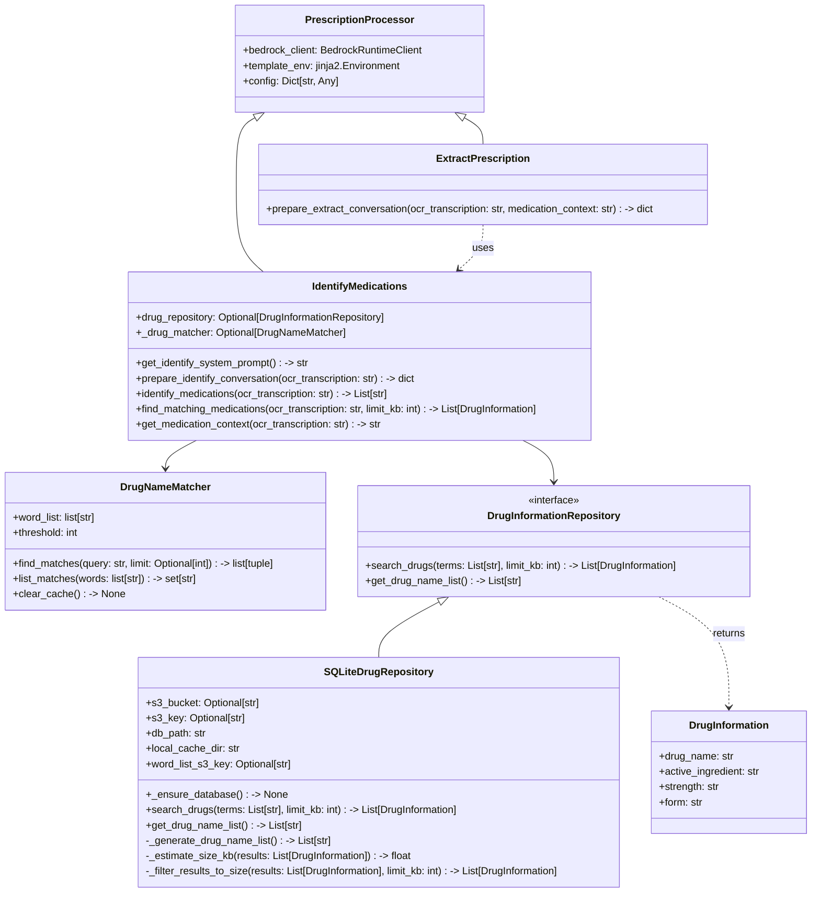
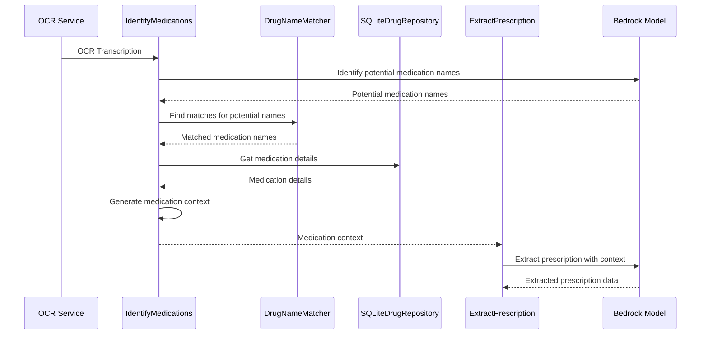

# Medication Identification Feature Design

## Overview

The Medication Identification feature enhances the Smart Prescription Reader by providing accurate identification and matching of medication names in prescription images. This feature addresses the challenge of correctly identifying medications when OCR transcription contains errors or misspellings. By leveraging a comprehensive drug database and fuzzy matching algorithms, the system can identify potential medication names and provide detailed information to the extraction model, significantly improving the accuracy of prescription processing.

The design follows a modular approach with clear separation of concerns:

1. **Drug Name Matcher**: Provides efficient fuzzy matching of medication names
2. **Drug Information Repository**: Manages access to the medication database
3. **Medication Identification**: Orchestrates the identification process and context generation
4. **Integration with Extraction**: Enhances the extraction process with medication context

## Architecture

### Component Diagram



### Data Flow



## Components and Interfaces

### 1. Drug Name Matcher

The `DrugNameMatcher` class is already implemented and provides efficient fuzzy matching of medication names. It uses the `rapidfuzz` library for string matching and implements a memory-safe caching strategy.

**Key Features:**

- Configurable similarity threshold
- Memory-efficient caching using closure pattern
- Batch processing of multiple words

**Interface:**

```python
class DrugNameMatcher:
    def __init__(self, word_list: list[str], threshold: int = 70):
        """Initialize with word list and threshold."""

    def find_matches(self, query: str, limit: Optional[int] = None) -> list[tuple[str, int, int | str]]:
        """Find matching drug names for the given query."""

    def clear_cache(self) -> None:
        """Clear the LRU cache for this instance."""

    def list_matches(self, words: list[str]) -> set[str]:
        """Process multiple words in batch and return unique matches."""
```

### 2. Drug Information Repository

The `DrugInformationRepository` interface defines the contract for accessing medication information. The `SQLiteDrugRepository` implementation uses a SQLite database stored in S3 for efficient access to medication details.

**Key Features:**

- Abstract interface for database access
- S3-based SQLite database with local caching
- Adaptive result size limiting
- Unified search across drug names and active ingredients
- Support for generating and retrieving drug name lists for fuzzy matching

**Data Model:**

```python
from pydantic import BaseModel, Field

class DrugInformation(BaseModel):
    """Model representing drug information from the repository."""
    drug_name: str = Field(description="Name of the drug")
    active_ingredient: str = Field(description="Active ingredient(s) in the drug")
    strength: str = Field(description="Strength/dosage of the drug")
    form: str = Field(description="Form of the drug (tablet, capsule, etc.)")
```

**Interface:**

```python
class DrugInformationRepository(ABC):
    @abstractmethod
    def search_drugs(self, terms: List[str], limit_kb: int = 100) -> List[DrugInformation]:
        """Search for drugs by terms across both drug names and active ingredients.

        Args:
            terms: List of search terms
            limit_kb: Maximum size of results in KB

        Returns:
            List of DrugInformation objects matching the search terms
        """

    @abstractmethod
    def get_drug_name_list(self) -> List[str]:
        """Get a list of all drug names and active ingredients for fuzzy matching."""
```

**Implementation:**

```python
class SQLiteDrugRepository(DrugInformationRepository):
    def __init__(self, s3_bucket: Optional[str] = None, s3_key: Optional[str] = None,
                 local_db_path: Optional[str] = None, local_cache_dir: Optional[str] = None,
                 word_list_s3_key: Optional[str] = None):
        """Initialize with S3 location and optional cache directory.

        Args:
            s3_bucket: S3 bucket containing the database (optional if local_db_path provided)
            s3_key: S3 key for the database file (optional if local_db_path provided)
            local_db_path: Direct path to a local database file (bypasses S3 download)
            local_cache_dir: Directory to cache downloaded files (default: tempdir)
            word_list_s3_key: S3 key for pre-built word list (optional)
        """

    def _ensure_database(self) -> None:
        """Download database from S3 if not already cached."""

    def search_drugs(self, terms: List[str], limit_kb: int = 100) -> List[DrugInformation]:
        """Search for drugs by terms across both drug names and active ingredients.

        This method searches for drugs where either the drug name or active ingredient
        contains any of the provided terms. The search is case-insensitive.

        Args:
            terms: List of search terms
            limit_kb: Maximum size of results in KB

        Returns:
            List of DrugInformation objects matching the search terms
        """

    def get_drug_name_list(self) -> List[str]:
        """Get a list of all drug names and active ingredients for fuzzy matching.

        This method will:
        1. Try to load a pre-built word list from S3 if word_list_s3_key was provided
        2. Generate the list from the database if no pre-built list exists
        3. Cache the generated list in memory for subsequent calls

        Returns:
            List of drug names and active ingredients for fuzzy matching
        """

    def _generate_drug_name_list(self) -> List[str]:
        """Generate a list of drug names and active ingredients from the database."""

    def _estimate_size_kb(self, results: List[DrugInformation]) -> float:
        """Estimate the size of results in KB."""

    def _filter_results_to_size(self, results: List[DrugInformation], limit_kb: int) -> List[DrugInformation]:
        """Filter results to fit within size limit."""
```

### 3. Medication Identification

The `IdentifyMedications` class extends the `PrescriptionProcessor` base class and orchestrates the medication identification process. It uses the Bedrock model to identify potential medication names, the `DrugNameMatcher` to find matches, and the `DrugInformationRepository` to retrieve medication details.

**Key Features:**

- Integration with Bedrock model for medication name identification
- Fuzzy matching of potential medication names
- Generation of formatted medication context
- Configurable through the existing configuration system

**Interface:**

```python
class IdentifyMedications(PrescriptionProcessor):
    def __init__(self, config: Dict[str, Any], drug_repository: Optional[DrugInformationRepository] = None):
        """Initialize with configuration and optional drug repository."""

    @property
    def drug_matcher(self) -> Optional[DrugNameMatcher]:
        """Lazy-load drug matcher with word list from config."""

    def get_identify_system_prompt(self) -> str:
        """Get the system prompt for medication identification."""

    def prepare_identify_conversation(self, ocr_transcription: str) -> dict[str, Any]:
        """Prepare the conversation parameters for medication identification."""

    def identify_medications(self, ocr_transcription: str) -> List[str]:
        """Identify medications in the prescription."""

    def find_matching_medications(self, ocr_transcription: str, limit_kb: int = 100) -> List[Dict[str, Any]]:
        """Identify medications and find matches in the drug database."""

    def get_medication_context(self, ocr_transcription: str) -> str:
        """Generate medication context for extraction prompts."""
```

### 4. Integration with Extraction, Evaluation, and Correction

The medication context is integrated into the extraction, evaluation, and correction processes by modifying the respective preparation methods to include the medication context as a message alongside the OCR text.

**Key Changes for ExtractPrescription:**

- Add `medication_context` parameter to `prepare_extract_conversation`
- Include medication context in the user content if available
- Update the extraction template to use medication context for correction

**Key Changes for EvaluateResponse:**

- Add `medication_context` parameter to `prepare_evaluate_conversation`
- Include medication context in the user content alongside the OCR text and extraction results
- Update the evaluation template to consider medication context when assessing extraction quality

**Key Changes for CorrectResponse:**

- Add `medication_context` parameter to `prepare_correct_conversation`
- Include medication context in the user content alongside the OCR text, extraction results, and evaluation feedback
- Update the correction template to use medication context for improving correction accuracy

**Important Note:**
The medication context should NOT be included in system prompts as these get cached, and medication context will vary with each prescription. Instead, it should be provided as a message alongside the OCR text in the user content for each request.

## Data Models

### Drug Database Schema

The SQLite database has the following schema:

```sql
CREATE TABLE drugs (
    drug_name TEXT,
    active_ingredient TEXT,
    strength TEXT,
    form TEXT
);

CREATE INDEX idx_active_ingredient ON drugs(active_ingredient COLLATE NOCASE);
CREATE INDEX idx_drug_name ON drugs(drug_name COLLATE NOCASE);
```

### Medication Context Format

The medication context is formatted as a string with the following structure:

```
##Medication Information##
Use this information to help correct transcription errors:
- Drug Name (Active Ingredient): Strength Form
- Drug Name (Active Ingredient): Strength Form
...
```

## Error Handling

### Database Access Errors

1. **Database Download Failure**

   - Log error with details
   - Raise exception to caller
   - Allow system to continue without medication context

2. **Query Errors**
   - Log error with details
   - Return empty result
   - Continue processing without medication context

### Model Response Errors

1. **Invalid JSON Response**

   - Use json_repair to attempt to fix malformed JSON
   - If repair fails, log error and raise ModelResponseError
   - Allow system to continue without medication context

2. **Empty Response**
   - Return empty list
   - Continue processing without medication context

## Testing Strategy

### Unit Tests

1. **DrugNameMatcher Tests**

   - Test exact matches
   - Test fuzzy matches with different thresholds
   - Test batch processing
   - Test caching behavior

2. **SQLiteDrugRepository Tests**

   - Test database initialization and caching
   - Test search by terms with different conditions
   - Test get by name and active ingredient
   - Test size limiting functionality

3. **IdentifyMedications Tests**
   - Test medication identification with mocked Bedrock responses
   - Test matching with mocked DrugNameMatcher
   - Test context generation with different inputs
   - Test error handling scenarios

### Integration Tests

1. **End-to-End Identification**

   - Test with real OCR transcription
   - Verify medication identification and matching
   - Verify context generation

2. **Extraction with Medication Context**
   - Test extraction with and without medication context
   - Verify improved accuracy with medication context

## Configuration

The medication identification feature is configured through the existing configuration system. The following configuration options are added:

```python
{
    "drug_match_threshold": 70,  # Similarity threshold for fuzzy matching
    "drug_word_list_key": "medications/drug-list.txt",  # S3 key for drug word list
    "drug_db_bucket": "smart-prescription-reader",  # S3 bucket for drug database
    "drug_db_key": "data/drugs.db",  # S3 key for drug database
    "max_result_size_kb": 100,  # Maximum size of medication context in KB
}
```

## Implementation Considerations

### Performance Optimization

1. **Database Caching**

   - Cache the SQLite database locally to minimize S3 downloads
   - Use a configurable cache directory with tempfile.gettempdir() as default

2. **Fuzzy Matching Optimization**

   - Use efficient fuzzy matching algorithms from rapidfuzz
   - Implement caching for frequently used queries
   - Use appropriate thresholds to balance accuracy and performance

3. **Result Size Management**
   - Implement adaptive filtering to limit result size
   - Use efficient data structures for memory management
   - Prioritize most relevant medication information

### Security Considerations

1. **Data Protection**

   - Ensure proper handling of sensitive medication information
   - Use secure S3 access with appropriate IAM policies
   - Implement proper error handling to prevent information leakage

2. **Resource Management**
   - Properly close database connections to prevent resource leaks
   - Implement timeout handling for external service calls
   - Use appropriate error handling to prevent resource exhaustion
