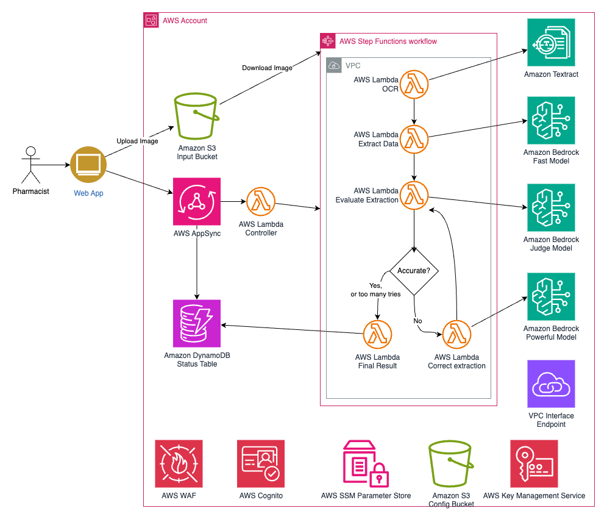
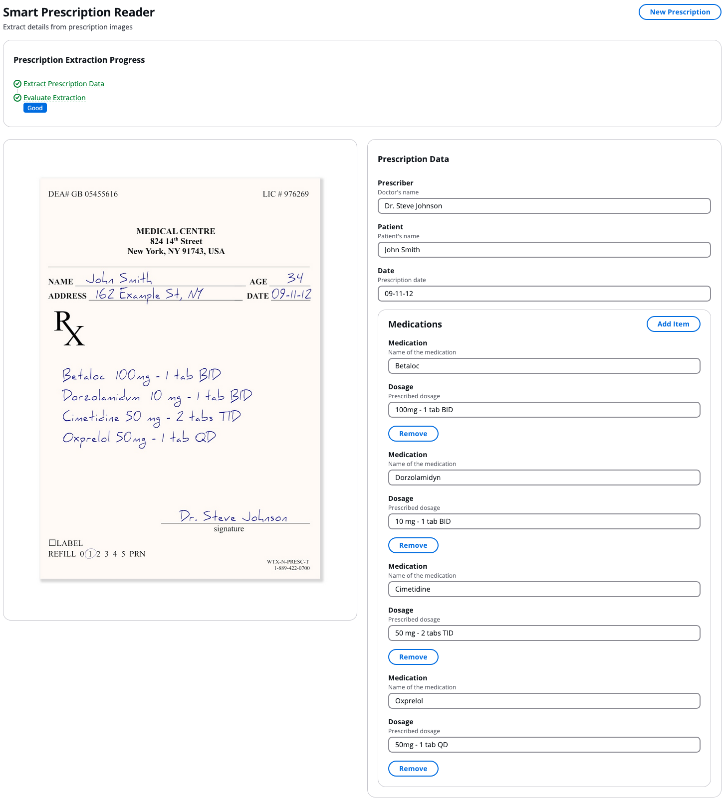

# Smart Prescription Reader

The Smart Prescription Reader is a prototype solution that extracts structured data from prescription images using AWS
Bedrock foundation models. It employs a multi-stage AI approach with specialized models for extraction, evaluation, and
correction, ensuring high accuracy while optimizing for cost and performance. Built on serverless AWS services including
Step Functions, Lambda, and AppSync, the solution provides a scalable architecture with built-in security controls for
handling sensitive medical information. This prototype demonstrates how generative AI can be practically applied to
automate document processing while maintaining accuracy through automated quality checks and corrections.

## Architecture


[Architecture Details](documentation/architecture.md#architecture-overview)

## Example



## Technical Approach

The Smart Prescription Reader employs a multi-stage AI-driven process to extract structured data from prescription
images. It uses generative AI foundation models for initial extraction, quality evaluation, and intelligent correction,
balancing speed, accuracy, and cost-effectiveness. The system adapts to varying prescription complexities, optimizes
performance through techniques like prompt caching, and maintains high accuracy with built-in quality assurance
mechanisms. This approach ensures scalable, auditable, and flexible prescription data extraction that can evolve with
business needs.

[ View Detailed Technical Approach](documentation/technical_approach.md#technical-approach).

## Cost

You are responsible for the cost of the AWS services used while running this solution. As of April 2025, the cost for
running this solution with the default settings in the US East (N. Virginia) Region is approximately $3,173.69 per month
processing 75,000 prescriptions.

The costs shown represent pricing without consideration of AWS free tier benefits.

We recommend creating a budget through [AWS Cost Explorer](http://aws.amazon.com/aws-cost-management/aws-cost-explorer/)
to help manage costs. Prices are subject to change. For full details, refer to the pricing webpage for each AWS service
used in this solution.

The following table provides a sample cost breakdown for deploying this solution with the default parameters in the US
East (N. Virginia) Region for one month:

### Cost estimate (75,000 prescriptions per month)

| AWS Service        | Usage                                           | Cost [USD]    |
|--------------------|-------------------------------------------------|---------------|
| Amazon Textract    | Extract unstructured text from images           | $112.50       |
| Amazon Bedrock     | Extract prescriptions(Anthropic Claude 3 Haiku) | $206.25       |
| Amazon Bedrock     | Evaluate result(Amazon Nova Pro)                | $918.00       |
| Amazon Bedrock     | Correct result(Anthropic Claude 3.7 Sonnet)     | $1,845.00     |
| AWS Step Functions | Workflow orchestration                          | $7.88         |
| AWS Lambda         | Function compute                                | $25.15        |
| Amazon DynamoDB    | Job status storage                              | $1.85         |
| Amazon S3          | Image and config storage                        | $0.79         |
| AWS AppSync        | GraphQL API                                     | $8.00         |
| AWS CloudWatch     | Logs                                            | $7.57         |
| AWS KMS            | Encryption keys                                 | $10.00        |
| AWS PrivateLink    | VPC endpoints                                   | $29.30        |
| Other services     | WAF, Cognito                                    | $1.40         |
| **Total**          |                                                 | **$3,173.69** |

With prompt caching enabled for supported models, the Bedrock costs can be reduced considerably.

Cost per prescription:

* With correction: $0.0423
* Without correction: $0.0116

The actual cost will vary based on:

* Number of prescriptions processed
* Percentage requiring corrections (default estimate assumes 80%)
* Length and complexity of prescriptions
* Selected Bedrock models
* Whether prompt caching is enabled

## Deployment and Development

### Repository Structure

This project is a monorepo managed by [Nx](https://nx.dev/) with packages for infrastructure, business logic, and the
demo application.

| Folder                          | Package                                                                                                 |
|---------------------------------|---------------------------------------------------------------------------------------------------------|
| packages/infra/                 | Infrastructure as Code in [AWS CDK](https://docs.aws.amazon.com/cdk/v2/guide/home.html)                 |
| packages/core/                  | Business logic in Python used in AWS Lambda functions                                                   |
| packages/demo/                  | [React](https://reactjs.org/) demo application with [Cloudscape](https://cloudscape.design/) components |
| packages/common/models-graphql/ | GraphQL schema and generated types                                                                      |

### Prerequisites

* Configure the AWS Credentials in your environment. Refer
  to [Authentication and access](https://docs.aws.amazon.com/sdkref/latest/guide/access.html).
* Download and install AWS CLI. Refer
  to [Installing the AWS CLI](https://docs.aws.amazon.com/cli/latest/userguide/getting-started-install.html).
* Install and configure AWS CDK. Refer to Installing
  the [AWS CDK](https://docs.aws.amazon.com/cdk/v2/guide/getting_started.html).
* Download and install Docker. Refer to [Docker](https://www.docker.com/products/docker-desktop/).
* NodeJS >= 18.0.0. You can manage NodeJs versions
  with [nvm](https://github.com/nvm-sh/nvm?tab=readme-ov-file#installing-and-updating)
  or [pnpm](https://pnpm.io/cli/env)
* Python >= 3.13. You can manage Python versions with [uv](https://docs.astral.sh/uv/#python-versions).
* uv >= 0.6.0. Refer to [uv installation guide](https://docs.astral.sh/uv/getting-started/installation/).
* pnpm >= 8.6.3. Refer to [pnpm installation guide](https://pnpm.io/installation).

```shell
# Install pnpm
curl -fsSL https://get.pnpm.io/install.sh | sh -

# Install uv
curl -LsSf https://astral.sh/uv/install.sh | sh

# Install required tools and versions
pnpm  env use --global 22
uv python install 3.13

# Install global packages
npm install -g aws-cdk

# Bootstrap AWS CDK
cdk bootstrap
```

### Activate Models in Amazon Bedrock

This prototype can use the Amazon Nova and Anthropic Claude models on Amazon Bedrock. You will need
to [enable them](https://docs.aws.amazon.com/bedrock/latest/userguide/model-access.html) for your account in the regions
you want to use.

If you choose to
use [Cross-Region Inference](https://docs.aws.amazon.com/bedrock/latest/userguide/cross-region-inference.html) for
increased throughput, you will need to activate the models in each region that will be used.

### Build and Deploy

The entire build and deployment can be done with just two commands:

```shell
pnpm install
nx deploy @smart-prescription-reader/infra
```

The deploy command will automatically trigger the necessary builds and then deploy the infrastructure. You should see
output similar to:

```
SmartPrescriptionReader: creating CloudFormation changeset...

 ✅  SmartPrescriptionReader

✨  Deployment time: 68.35s

Outputs:
SmartPrescriptionReader.ConfigBucketName = smartprescriptionreader-graph-configbucket2112c5ec-nklpf9njwtb3
SmartPrescriptionReader.ImagesBucketName = smartprescriptionreader-graph-imagesbucket1e86afb2-gj37da0zaxgv
SmartPrescriptionReader.UserIdentityPoolId = us-east-1_bQtq1lmbk
SmartPrescriptionReader.UserIdentityUserIdentityIdentityPoolId7D1EA400 = us-east-1:548af07e-e760-4391-b4e4-46783af2d6e7
SmartPrescriptionReader.UserIdentityUserIdentityUserPoolId21B35D31 = us-east-1_bQtq1lmbk
SmartPrescriptionReader.WebsiteUrl = See packages/demo/README.md
SmartPrescriptionReader.WorkflowCorrectResponseLambdaCorrectResponseLambdaConfigC73411FF = /SmartPrescriptionReader/CorrectResponseLambdaConfig
SmartPrescriptionReader.WorkflowEvaluateResponseLambdaEvaluateResponseLambdaConfigA5909445 = /SmartPrescriptionReader/EvaluateResponseLambdaConfig
SmartPrescriptionReader.WorkflowExtractPrescriptionLambdaExtractPrescriptionLambdaConfig28E0C5F9 = /SmartPrescriptionReader/ExtractPrescriptionLambdaConfig
```

### Configuration

After deploying the infrastructure, you can optionally configure the following components to enhance the Smart
Prescription Reader's performance:

1. Upload Medication List

Upload a list of medications to the configuration bucket to improve medication name recognition.
Depending on your use case, this can include trade names, active ingredients, and dosage.

```shell
aws s3 cp path/to/your/medication-list.txt s3://<ConfigBucketName>/medications/drug-list.txt
```

2. Upload Glossary

Upload a glossary of medical terms to the configuration bucket to enhance term recognition.

```shell
aws s3 cp path/to/your/glossary.txt s3://<ConfigBucketName>/glossary/prescription-terms.txt
```

3. Configure Lambda Functions

Use AWS Systems Manager Parameter Store to configure the extraction, evaluation, and correction Lambda functions. The
parameter names are provided in the CloudFormation stack outputs.

The configuration supports prompt caching for supported Bedrock models to improve performance and reduce costs. As of
April 2025, prompt caching is supported for:

- Anthropic Claude 3.7 Sonnet (anthropic.claude-3-7-sonnet-20250219-v1:0)
- Anthropic Claude 3.5 Haiku (anthropic.claude-3-5-haiku-20241022-v1:0)
- Amazon Nova Micro (amazon.nova-micro-v1:0)
- Amazon Nova Lite (amazon.nova-lite-v1:0)
- Amazon Nova Pro (amazon.nova-pro-v1:0)

Example configuration (adjust values as needed):

```shell    
aws ssm put-parameter \
    --name "/SmartPrescriptionReader/ExtractPrescriptionLambdaConfig" \
    --type "String" \
    --value '{
        "modelId": "anthropic.claude-3-haiku-20240307-v1:0",
        "temperature": 0.0,
        "medicationsKey": "medications/drug-list.txt",
        "glossaryKey": "glossary/prescription-terms.txt",
        "thinking": true,
        "transcribe": false,
        "promptCacheModels": [
            "anthropic.claude-3-7-sonnet-20250219-v1:0",
            "anthropic.claude-3-5-haiku-20241022-v1:0",
            "amazon.nova-micro-v1:0",
            "amazon.nova-lite-v1:0",
            "amazon.nova-pro-v1:0"
        ]
    }' \
    --overwrite

aws ssm put-parameter \
    --name "/SmartPrescriptionReader/EvaluateResponseLambdaConfig" \
    --type "String" \
    --value '{
        "modelId": "anthropic.claude-3-sonnet-20240229-v1:0",
        "temperature": 0.0,
        "medicationsKey": "medications/drug-list.txt",
        "glossaryKey": "glossary/prescription-terms.txt",
        "thinking": true,
        "transcribe": false,
        "promptCacheModels": [
            "anthropic.claude-3-7-sonnet-20250219-v1:0",
            "anthropic.claude-3-5-haiku-20241022-v1:0",
            "amazon.nova-micro-v1:0",
            "amazon.nova-lite-v1:0",
            "amazon.nova-pro-v1:0"
        ]
    }' \
    --overwrite

aws ssm put-parameter \
    --name "/SmartPrescriptionReader/CorrectResponseLambdaConfig" \
    --type "String" \
    --value '{
        "modelId": "anthropic.claude-3-sonnet-20240229-v1:0",
        "temperature": 0.0,
        "medicationsKey": "medications/drug-list.txt",
        "glossaryKey": "glossary/prescription-terms.txt",
        "thinking": true,
        "transcribe": false,
        "promptCacheModels": [
            "anthropic.claude-3-7-sonnet-20250219-v1:0",
            "anthropic.claude-3-5-haiku-20241022-v1:0",
            "amazon.nova-micro-v1:0",
            "amazon.nova-lite-v1:0",
            "amazon.nova-pro-v1:0"
        ]
    }' \
    --overwrite
```

Adjust the configuration values based on your specific requirements and the available Bedrock models in your region. The
`promptCacheModels` list can be updated as more models add support for prompt caching.
See [Amazon Bedrock prompt caching documentation](https://docs.aws.amazon.com/bedrock/latest/userguide/prompt-caching.html)
for the latest list of supported models.

These configuration steps are optional but can significantly improve the accuracy and performance of the Smart
Prescription Reader.

## Demo

The Smart Prescription Reader includes a demo web application
in [packages/demo](packages/demo/README.md#smart-prescription-reader---demo-website) that showcases the prescription
data extraction capabilities. The demo allows you to:

* Upload prescription images
* Review extracted data alongside the original image

## Cleanup

In the event that you decide to stop using the prototype, we recommend that you follow a tear-down procedure. Most of
the services used have no cost when there is no active use with the notable exception of storage in S3, DynamoDB, and
CloudWatch Logs and keys in AWS KMS. AWS CloudFormation via CDK will tear down all resources except for Amazon S3
buckets and AWS CloudWatch
Logs log groups with data and AWS KMS Customer Managed Keys(CMK).

1. On the AWS CloudFormation console or using AWS CDK in the terminal, destroy the stacks that were deployed. Some of
   the S3 buckets will remain as they will not be empty.
2. Delete any CloudWatch Logs log groups that you do not wish to keep.
3. In any S3 buckets that remain that you do not wish to keep, empty the buckets by disabling logging and configuring a
   lifecycle policy that expires objects after one day. Wait a day.
4. After a day, go back and delete the buckets.
5. Schedule deletion of any KMS CMKs that you do not wish to keep.

## Improvements

As part of the prototype process, we have some [improvement ideas](documentation/improvements.md#improvements) for your
path to production.

## Security Guideline

Please see the [security guidelines](documentation/security.md#security).

This is sample code, for non-production usage. Before using Smart Prescription Reader, you should consider conducting
your own independent assessment to ensure that your use would comply with your own specific security and quality control
practices and standards, as well as the laws, rules, and regulations that govern you and your content.