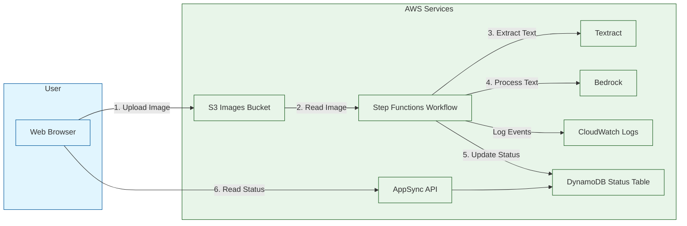

# Architecture Overview

The Smart Prescription Reader is built on a serverless, event-driven architecture leveraging various AWS services. This
design ensures scalability, cost-efficiency, and robust security.

## Components

1. **API Layer**:
    - AWS AppSync GraphQL API
    - Provides a unified interface for frontend-backend communication
    - Secured with Amazon Cognito for user authentication

2. **Processing Orchestration**:
    - AWS Step Functions state machine
    - Coordinates the multi-step prescription processing workflow

3. **Serverless Compute**:
    - AWS Lambda functions for various tasks:
        - Image upload handling
        - Prescription data extraction
        - Quality evaluation
        - Data correction
        - Job status updates

4. **AI/ML Integration**:
    - Amazon Textract for OCR
    - Amazon Bedrock for accessing foundation models
    - Used for text extraction, evaluation, and correction

6. **Data Storage**:
    - S3 buckets for prescription images and configuration files
    - DynamoDB for job status tracking and results storage

7. **Security**:
    - VPC with isolated subnets for network security
    - VPC Interface endpoints for private AWS service access
    - KMS Customer Managed Keys (CMKs) for encryption
    - Cognito and IAM for authentication and authorization

## Data Flow

[comment]: # (@formatter:off)

[comment]: # (@formatter:on)

1. Users upload prescription images through the web interface.
2. The AppSync API triggers a Lambda function to generate a pre-signed S3 URL.
3. The image is uploaded directly to S3 from the client.
4. A Step Functions workflow is initiated to process the prescription:
    1. Extract text using Textract
    2. Extract data using a fast Bedrock model
    3. Evaluate extraction quality
    4. If needed, correct data using a more powerful model
5. Lambda functions interact with Bedrock models at each step.
6. Job status and results are stored in DynamoDB.
7. The frontend polls the AppSync API for job status and displays results when ready.

This architecture allows for:

- Scalable processing of prescriptions with variable complexity
- Cost optimization through serverless compute and pay-per-use AI models
- Strong security controls for sensitive medical data
- Flexibility to add or modify processing steps as requirements evolve

The use of infrastructure-as-code (AWS CDK) ensures consistent deployment and easier management of the entire stack.