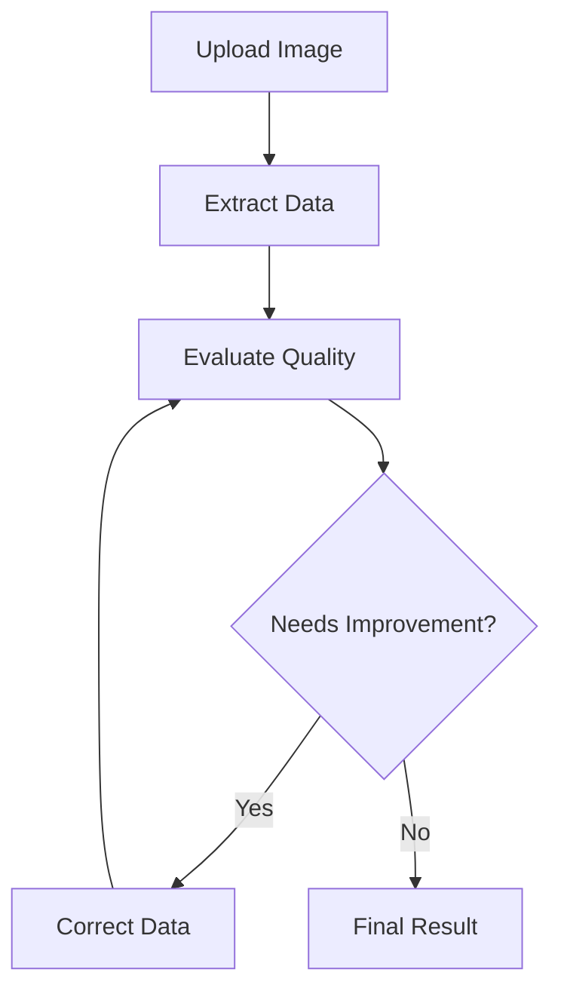

# Technical Approach

The Smart Prescription Reader prototype tackles the challenge of extracting structured data from prescription images
through a systematic approach that mirrors how a human would process the same information. Here's how we solved this
problem:

## Multi-Stage Processing

We break down the complex task of reading prescriptions into distinct stages that work together:

1. **Initial Extraction**: A fast model quickly extracts information from the prescription image, identifying key
   elements like patient details, medications, and dosage instructions.

2. **Quality Check**: A separate evaluation model assesses the quality of the extracted data, looking for potential
   errors or missed information. It provides a score to gauge the confidence. This acts like a second pair of eyes
   reviewing the work.

3. **Intelligent Correction**: If the quality check identifies issues, a more powerful model attempts to improve the
   extraction based on the specific feedback. This is similar to having an expert review and correct initial work.

## Adaptive Intelligence

Rather than using a one-size-fits-all approach, we employ different specialized AI models for each task:

- A fast model for initial data extraction
- A precise model for quality evaluation
- A powerful model for complex corrections

This approach allows us to balance speed, accuracy, and cost. Simple prescriptions can be processed quickly, while
complex cases receive additional attention only when needed.

## Quality Assurance

The system rates extraction quality on a scale from "Poor" to "Excellent":

- **Excellent**: All legible content correctly extracted
- **Good**: Minor discrepancies in formatting or capitalization
- **Fair**: Some incorrect transcriptions
- **Poor**: Multiple errors or missed information

This rating system helps maintain high accuracy by triggering corrections when needed while avoiding unnecessary
processing of already accurate extractions.

## Performance Optimization

To improve efficiency and reduce costs, we implemented several optimizations:

- **Prompt Caching**: Frequently used instructions are cached to reduce processing time and costs
- **Progressive Processing**: More powerful (and expensive) models are only used when needed
- **Configurable Workflow**: The number of correction attempts can be adjusted based on accuracy requirements

## Business Considerations

The solution addresses several key business needs:

- **Accuracy**: Multiple validation steps ensure high-quality data extraction
- **Cost Control**: Efficient use of AI models balances performance and cost
- **Scalability**: The system automatically handles varying workloads
- **Auditability**: Complete tracking of all processing steps and decisions
- **Flexibility**: Configurable schemas allow extraction of different prescription formats

## Future Adaptability

The system is designed to easily incorporate:

- New AI models as they become available
- Additional prescription formats
- Enhanced validation rules
- Improved correction strategies

This approach provides a robust foundation that can evolve with changing business needs while maintaining consistent,
high-quality results.