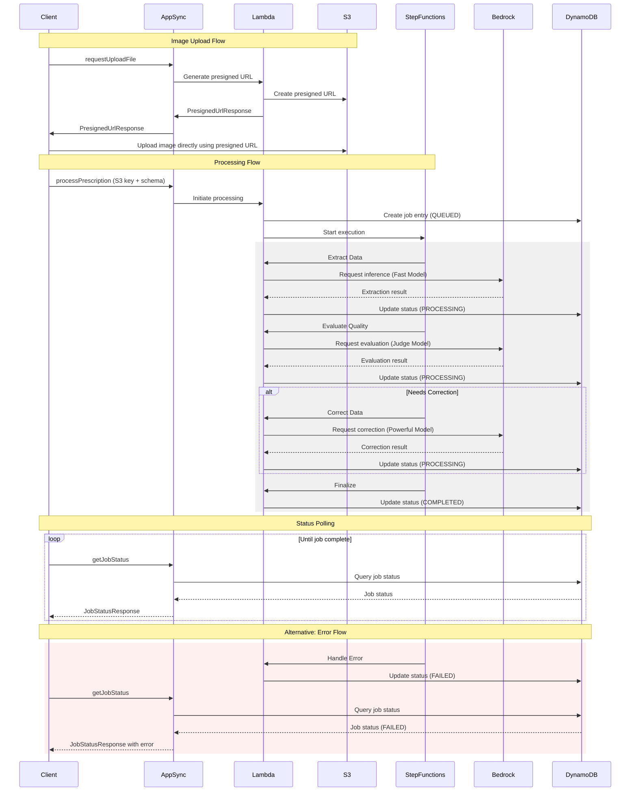

# Smart Prescription Reader Core Package

This package contains the core business logic for the Smart Prescription Reader, implemented in Python and designed to
run on AWS Lambda.

## Structure

```
packages/core/
├── smart_prescription_reader/
│   ├── lambda_handlers/         # Lambda function entry points
│   ├── PrescriptionProcessor/   # Core processing logic
│   ├── JobStatus/               # Job status management
│   ├── models/                  # Pydantic models for data validation
│   └── prompts/                 # Jinja2 templates for AI prompts
├── tests/                       # Unit and integration tests
├── Dockerfile                   # For building Lambda deployment packages
└── pyproject.toml               # Python project configuration
```

## Key Components

1. **Lambda Handlers**: Entry points for AWS Lambda functions, handling events from AWS AppSync and Step Functions.
2. **PrescriptionProcessor**: Contains the logic for extracting, evaluating, and correcting prescription data using
   Bedrock models.
3. **JobStatus**: Manages job state in DynamoDB.
4. **Models**: Pydantic models for data validation and serialization.
5. **Prompts**: Jinja2 templates for generating prompts for Bedrock models.

## Development Guidelines

### Adding or Modifying Lambda Functions

1. Create a new file in `lambda_handlers/` or modify existing ones.
2. Use the `@event_parser` decorator from AWS Lambda Powertools to parse incoming events.
3. Implement error handling and logging using Lambda Powertools.

### Modifying AI Processing Logic

1. Update relevant files in `PrescriptionProcessor/`.
2. Modify prompt templates in `prompts/` if changing model interactions.
3. Update `config.py` if adding new configuration options.

### Data Model Changes

1. Update the GraphQL schema (`packages/common/models-graphql/`).
2. Regenerate the models `nx run-many --target=generate --parallel`.

### Adding Dependencies

The project uses [uv](https://github.com/astral-sh/uv) for dependency management:

```shell
uv pip install package-name
```

## Testing

For integration tests, set up your environment using the resources deployed with CDK in `.env.integration` following
`example.env.itegration`.

- Run unit tests: `uv run pytest`
- Run integration tests: `uv run pytest -m integration`

## Deployment

The core package is deployed as part of the CDK stack. The `Dockerfile` is used to build a Lambda deployment package
including all dependencies.

## Configuration

- Runtime configuration is managed through AWS Systems Manager Parameter Store.
- Update `PrescriptionProcessor/config.py` for new configuration options.
- The CDK stack (`packages/infra/`) defines which parameters are used by each Lambda.

## Best Practices

1. Follow PEP 8 style guide.
2. Use type hints throughout the codebase.
3. Write unit tests for new functionality.
4. Use Lambda Powertools for logging, tracing, and metrics.
5. Keep Lambda functions small and focused.
6. Use environment variables for configuration where appropriate.

## Extending the Workflow

To add new steps to the prescription processing workflow:

1. Create a new Lambda function in `lambda_handlers/`.
2. Update the Step Functions definition in the CDK stack.
3. Add necessary permissions to the Lambda execution role.
4. Update `JobStatus` enum in the graphql schema if adding new states.

## Security Considerations

- Never log sensitive information (e.g., prescription details).
- Use KMS for encrypting sensitive data at rest.
- Ensure all S3 operations use encryption in transit.
- Follow least privilege principle when granting permissions to Lambda functions.

## Troubleshooting

- Check CloudWatch Logs for Lambda function logs.
- Use AWS X-Ray for tracing request flows through the system.
- Refer to `exceptions.py` for custom exception types used in the application.

For more detailed architecture and flow information, refer to the main project README and documentation.


